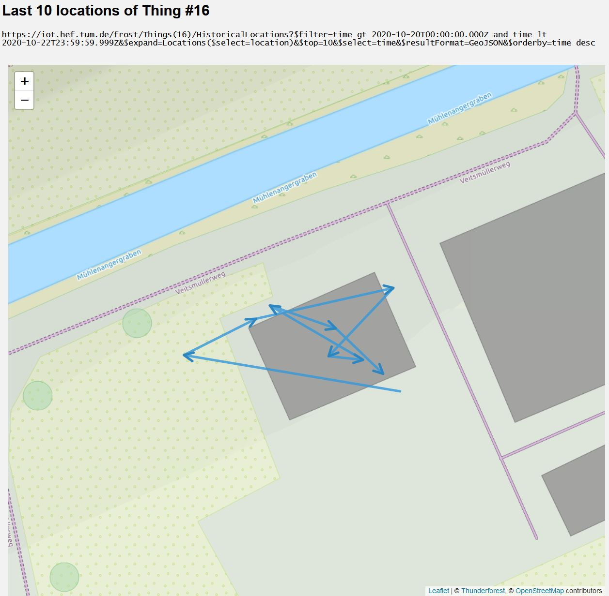

========================
FROST locations on a map
========================

This repo contains some basic example on how to query ``Locations`` and ``HistoricalLocations``
from a `FROST-Server <https://github.com/FraunhoferIOSB/FROST-Server>`_ instance and place them
on a web map using Open Source mapping APIs like `Leaflet.js <https://leafletjs.com/>`_.

***************************************************************
Trajectory with directional arrows from ``HistoricalLocations``
***************************************************************

Query the last n ``HistroicalLocations`` from a given ``Thing`` in a time period (optional)
and plot a trajectory with `ArrowHeads <https://github.com/slutske22/leaflet-arrowheads>`_
from it.

Adapt lines 15-18 of ``js/trajectory.js``:

.. code-block:: javascript

  // FROST server and, Thing, number of HistoricalLocations, time filter (optional)
  var frostBaseURL = 'https://iot.hef.tum.de/frost';
  var thingIotID = 16;
  var nHistoricalLocations = 10;
  var timeIntervalFilter = '$filter=time%20gt%202020-10-20T00:00:00.000Z%20and%20time%20lt%202020-10-22T23:59:59.999Z';

Open ``trajectory.html`` in a browser to view the result.

