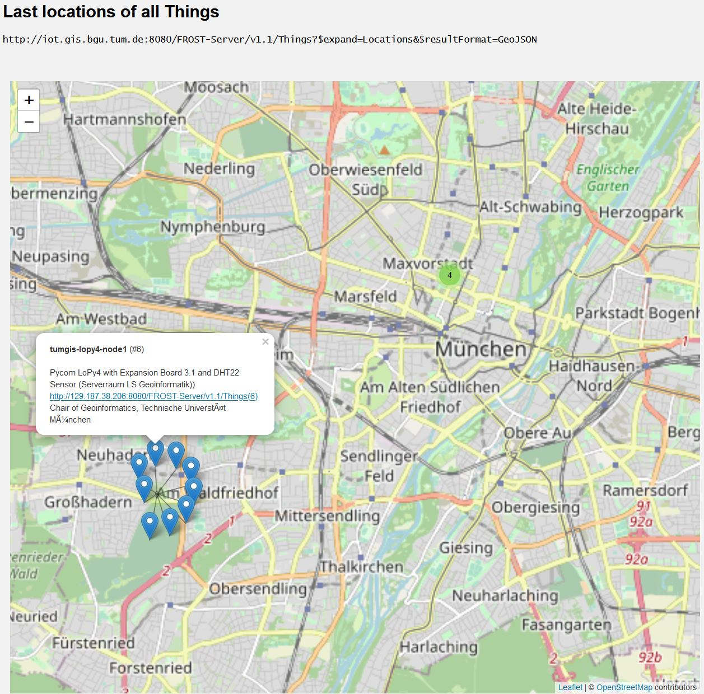

======================================
SensorThingsAPI ``Locations`` on a map
======================================

This repo contains some basic examples on how to query ``Locations`` and ``HistoricalLocations``
from an `OGC SensorThingsAPI <https://www.ogc.org/standards/sensorthings>`_ conform service,
as for instance `FROST-Server <https://github.com/FraunhoferIOSB/FROST-Server>`_ instance and place them
on a web map using Open Source mapping APIs like `Leaflet.js <https://leafletjs.com/>`_.

****************
Location markers
****************

Plot the last ``Locations`` of all ``Things`` on a map and add a popup to the markers with basic
informations on the ``Thing``. To cluster markers at the same location
`Leaflet MarkerCluster <https://github.com/Leaflet/Leaflet.markercluster>`_ is used.

Adapt line 16 of ``js/locationMarkers/locationMarkers.js`` to change the FROST instance.

.. code-block:: javascript

  // Configure FROST instance
  var frostBaseURL = 'https://my.frost.server.de/FROST-Server/v1.1';

Open ``locationMarkers.html`` in a browser to view the results.

***************************************************************
Trajectory with directional arrows from ``HistoricalLocations``
***************************************************************

Query the last n ``HistroicalLocations`` from a given ``Thing`` in a time period (optional)
and plot a trajectory with `ArrowHeads <https://github.com/slutske22/leaflet-arrowheads>`_
from it.

Adapt lines 15-18 of ``js/trajectory/trajectory.js``:

.. code-block:: javascript

  // FROST server, Thing, number of HistoricalLocations, time filter (optional)
  var frostBaseURL = 'https://my.frost.server.de/FROST-Server/v1.1';
  var thingIotID = 16;
  var nHistoricalLocations = 10;
  var timeIntervalFilter = '$filter=time%20gt%202020-10-20T00:00:00.000Z%20and%20time%20lt%202020-10-22T23:59:59.999Z';

Open ``trajectory.html`` in a browser to view the result.

.. image:: docs/img/example-trajectory.jpg
   :width: 600
   :alt: Example trajectory from FROST HistroicalLocations
